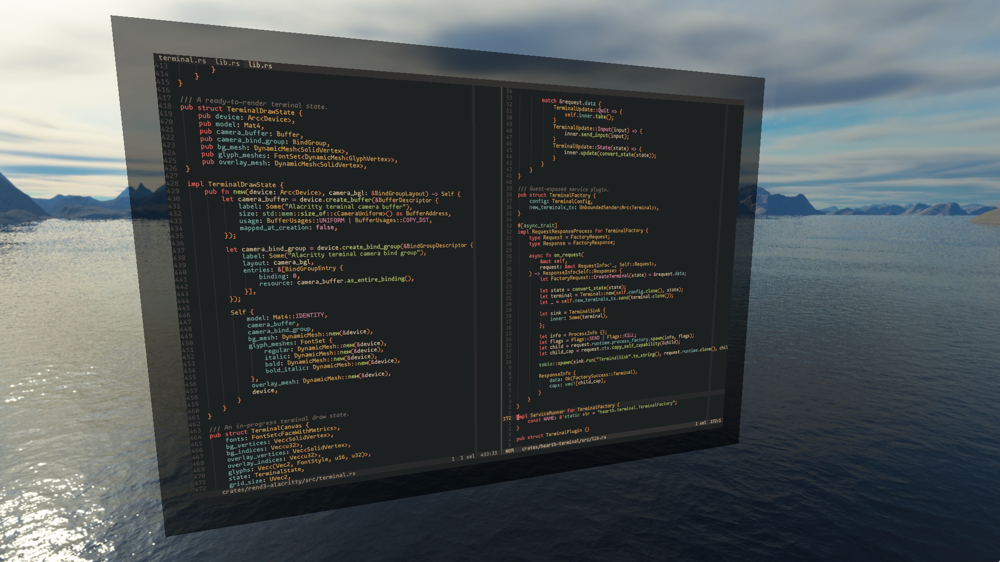
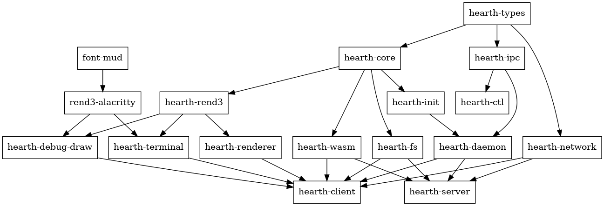

<div align="center">


# Hearth

<p align="center">
  <a href="https://discord.gg/gzzJ3pWCft">
    
  </a>
  <a href="https://matrix.to/#/#hearth:leyline.witchcraft.zone">
    
  </a>
  <a href="https://coven.witchcraft.zone/@hearth">
    
  </a>
  
</p>

Hearth is a shared, always-on execution environment for constructing
3D virtual spaces from the inside.

[Philosophy](#philosophy) •
[Setup and Installation](#setup-and-installation) •
[Design Document](/DESIGN.md) •
[Contributing](/CONTRIBUTORS.md)

</div>

# Screenshots

<div align="center">
  <figure>
    
    <figcaption>A screenshot of the Hearth terminal emulator demo program editing its own source code.</figcaption>
  </figure>
</div>

# The History of Virtual Worlds

Shared virtual spaces have been around for decades, in many forms. Before PCs
were capable of 3D graphics, a popular kind of virtual space were multi-user
dungeons, or MUDs. Users can connect to MUDs from a text-based client like
telnet, and join other users in a textual virtual world. Although most MUDs
only have server-provided worlds that constrained users into their preset
rules, some MUDs (such as MUCKs and MOOs) allow users to extend the world with
their own functionality. In the early 2000s, Second Life implemented the same
principles but in a 3D space instead of a textual one. Users can create their
own spatial virtual worlds or enter other users' worlds with a 3D avatar. In
the modern day, platforms such as Roblox, VRChat, Rec Room, and Neos all
perform the same basic task, but in virtual reality. The decades-old
commonality between all of these diversity platforms is user-created content.
What's next?

# Philosophy

Hearth is a proof-of-concept of a new design philosophy for constructing shared
virtual spaces based on three fundamental design principles:

1. All content in the space can be extended and modified at runtime. This
  includes models, avatars, textures, sounds, UIs, and so on. Importantly,
  scripts can also be loaded at runtime, so that the behavior of the space
  itself can be extended and modified.
2. The space can pull content from outside sources. The space can load data
  from a user's filesystem or the Internet, and new scripts can be written to
  support loading unrecognized formats into the space.
3. The space itself can be used to create content. Tooling for creating assets
  for the space is provided by the space itself and by scripts extending that
  tooling.

Following these principles, a space can construct a content feedback loop that
can be fed by outside sources. Users can create their own content while
simultaneously improving their tooling to create content, all without ever
leaving the space. The result is an environment that can stay on perpetually
while accumulating more and more content. The space will grow in scale to
support any user's desires, and it can remix the creative content that already
exists on the Internet. This space has the potential to become a
next-generation form of traversing and defining the Internet in a collaborative
and infinitely adaptable way.

Hearth's objective is to create a minimalist implementation of these
principles, and find a shortest or near-shortest path to creating a
self-sustaining virtual space. To do this, the development loop between
script execution, content, and content authoring must be closed. This process
is analagous to bootstrapping an operating system, where once the initial
system is set up, the system itself can be used to expand itself. Once Hearth
has achieved this, the next goal will be to explore and research the
possibilities of the shared virtual space, to evaluate potential further use of
its design principles.

Read more about Hearth's design and architecture in its
[design document](/DESIGN.md).

# Use Cases

Hearth is a flexible, non-application-specific platform with countless
opportunities to specialize. Here are some ideas to spark your imagination:
- **Education**: Teach students in an environment that can be tailored to the curriculum content on the fly.
- **Data visualization**: Interact with dynamic statistical data spatially and collaboratively, not just visually on your desktop.
- **Co-working**: Need a low-cost, remote-friendly office for your team members to share? Hearth has you covered.
- **Meetings**: Bring your presentations and your audiences together in the same 3D space.
- **Game development**: Rapidly prototype and test 3D video games without needing to restart the engine.
- **VR development**: Create to your heart's desire without ever having to take your headset off.
- **Plain old escapism**: Hearth is self-hosted, free software and the potentials for cultural and artistic expression in whole new virtual worlds are endless.

# Setup and Installation

To run Hearth you must build it from source. Hearth is written in Rust, so to
compile Hearth you must [install the Rust toolchain](https://www.rust-lang.org/tools/install).
You also need to install [Git](https://git-scm.com) to clone Hearth's source
repository.

Once you have all of the development tools installed, open a command prompt
and run these commands in the directory where you'd like your local repository:

```sh
git clone https://github.com/hearth-rs/hearth.git # clone Hearth locally
cd hearth # change directory into the source tree root
cargo build --release # build Hearth in release mode
```

Once Cargo has finished, you can find Hearth's binaries in the `target/release`
directory:

- the client's binary is located at `target/release/hearth-client`
- the server's binary is located at `target/release/hearth-server`
- the CLI's binary is located at `target/release/hearth-ctl`

More information on how to run each binary once compiled can be displayed using
the `--help` flag on any binary.

Example:

```sh
hearth-server --help # prints usage info for the Hearth server
```

## Running with Kindling
The provided Hearth binaries act as a runtime and will do nothing on their own.
For Hearth to work properly it needs a WebAssembly script to serve as the init
system and a directory to serve as its root. Hearth's binaries will assume the
init system is located in the root and named `init.wasm` if one is not provided
manually. Hearth ships with a set of batteries-included utilities for use
with the runtime, named Kindling. Kindling's source code is located with this
repository [here](./kindling/). Kindling's root and init system can be built
with the script found in the tools directory.

A Cargo alias is provided for ease of use:

```sh
cargo build-root # build Kindling using the build script.
```

Now that the root has been built, Hearth can be ran with Kindling as its root:

```sh
hearth-client --root kindling/target/kindling-root/ # Run Hearth in serverless mode with the given root.
```

# Workspace Layout

Hearth's codebase is composed of a single Rust workspace divided into many
crates, each with a dedicated purpose. Here are a few specific, important crates
to be aware of:

- **hearth-runtime**: a common library that provides the APIs for plugins, asset
    loading, the lump store, and runtime building. Because the `hearth-runtime`
    API is essential to most Hearth functionality, most crates in the Hearth
    codebase depend on it.
- **hearth-schema**: a schema crate that defines the guest-to-host message
    protocols. Since the purpose of most Hearth crates is to provide some kind
    of native resource to guest processes, most crates depend on `hearth-schema`.
- **hearth-client** and **hearth-server**: the main Hearth application binaries,
    implementing the client and server, respectively. Each depends on a variety
    of plugin crates, since they build and run the runtimes that use those
    plugins.
- **hearth-ctl**: a command-line IPC client to perform common operations on
    a Hearth runtime. Only depends on `hearth-schema` to define the IPC protocol
    and `hearth-ipc` to implement OS-specific IPC transport mechanisms.

Outside of these special cases, the rest of the crates in the Hearth codebase
implement plugins. Here's a dependency graph of the whole workspace:


