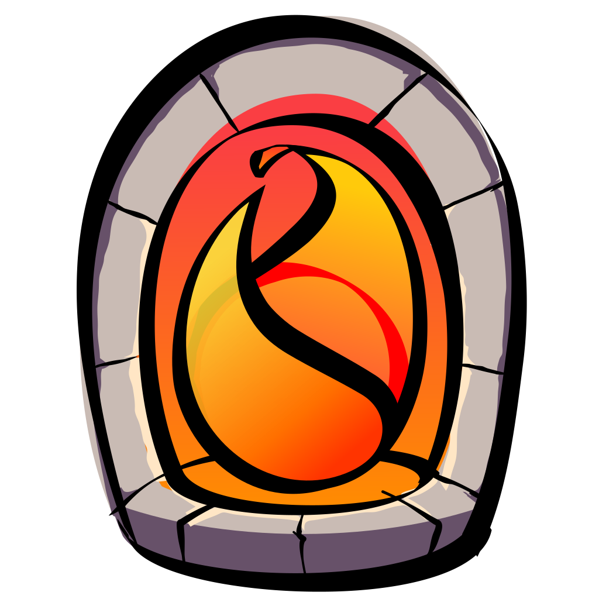

<div align="center">



# Hearth

Hearth is a shared, always-on execution environment for constructing
3D virtual spaces from the inside.

[Philosophy](#philosophy) •
[Setup and Installation](#setup-and-installation) •
[Design Document](/DESIGN.md) •
[Contributing](/CONTRIBUTORS.md) •
[Discord server](https://discord.gg/gzzJ3pWCft)

<a href="https://www.gnu.org/licenses/agpl-3.0.html">
  
</a>

Hearth's logo was created (c) 2023 by [Sasha Koshka](https://holanet.xyz) and
is licensed under a
[Creative Commons BY-SA 4.0 license](https://creativecommons.org/licenses/by-sa/4.0).

</div>

# The History of Virtual Worlds

Shared virtual spaces have been around for decades, in many forms. Before PCs
were capable of 3D graphics, a popular kind of virtual space were multi-user
dungeons, or MUDs. Users can connect to MUDs from a text-based client like
telnet, and join other users in a textual virtual world. Although most MUDs
only have server-provided worlds that constrained users into their preset
rules, some MUDs (such as MUCKs and MOOs) allow users to extend the world with
their own functionality. In the early 2000s, Second Life implemented the same
principles but in a 3D space instead of a textual one. Users can create their
own spatial virtual worlds or enter other users' worlds with a 3D avatar. In
the modern day, platforms such as Roblox, VRChat, Rec Room, and Neos all
perform the same basic task, but in virtual reality. The decades-old
commonality between all of these diversity platforms is user-created content.
What's next?

# Philosophy

Hearth is a proof-of-concept of a new design philosophy for constructing shared
virtual spaces based on three fundamental design principles:

1. All content in the space can be extended and modified at runtime. This
  includes models, avatars, textures, sounds, UIs, and so on. Importantly,
  scripts can also be loaded at runtime, so that the behavior of the space
  itself can be extended and modified.
2. The space can pull content from outside sources. The space can load data
  from a user's filesystem or the Internet, and new scripts can be written to
  support loading unrecognized formats into the space.
3. The space itself can be used to create content. Tooling for creating assets
  for the space is provided by the space itself and by scripts extending that
  tooling.

Following these principles, a space can construct a content feedback loop that
can be fed by outside sources. Users can create their own content while
simultaneously improving their tooling to create content, all without ever
leaving the space. The result is an environment that can stay on perpetually
while accumulating more and more content. The space will grow in scale to
support any user's desires, and it can remix the creative content that already
exists on the Internet. This space has the potential to become a
next-generation form of traversing and defining the Internet in a collaborative
and infinitely adaptable way.

Hearth's objective is to create a minimalist implementation of these
principles, and find a shortest or near-shortest path to creating a
self-sustaining virtual space. To do this, the development loop between
script execution, content, and content authoring must be closed. This process
is analagous to bootstrapping an operating system, where once the initial
system is set up, the system itself can be used to expand itself. Once Hearth
has achieved this, the next goal will be to explore and research the
possibilities of the shared virtual space, to evaluate potential further use of
its design principles.

Read more about Hearth's design and architecture in its
[design document](/DESIGN.md).

# Setup and Installation

To run Hearth you must build it from source. Hearth is written in Rust, so to
compile Hearth you must [install the Rust toolchain](https://www.rust-lang.org/tools/install).
You also need to install [Git](https://git-scm.com) to clone Hearth's source
repository.

Once you have all of the development tools installed, open a command prompt
and run these commands in the directory where you'd like your local repository:

```sh
git clone https://github.com/hearth-rs/hearth.git # clone Hearth locally
cd hearth # change directory into the source tree root
cargo build --release # build Hearth in release mode
```

Once Cargo has finished, you can find Hearth's binaries in the `target/release`
directory:

- the client's binary is located at `target/release/hearth-client`
- the server's binary is located at `target/release/hearth-server`
- the CLI's binary is located at `target/release/hearth-ctl`

More information on how to run each binary once compiled can be displayed using
the `--help` flag on any binary.

Example:

```sh
hearth-server --help # prints usage info for the Hearth server
```

# Roadmap

## Phase 0: Pre-Production

In phase 0, Hearth documents its purpose, proposes an implementation, decides
on which libraries and resources to use in its development, and finds a handful
of core developers who understand Hearth's goals and who are capable of
meaningfully contributing in the long run.

- [ ] write a design document
- [x] create a Discord server
- [x] create a GitHub repository
- [ ] onboard 3-4 core developers who can contribute to Hearth long-term
- [x] design a project logo
- [ ] set up continuous integration to check pull requests
- [x] write a CONTRIBUTORS.md describing contribution workflow
- [x] design a workspace structure
- [x] set up licensing headers and copyright information
- [ ] finalize the rest of the phases of the roadmap
- [ ] create mocks for all of the codebase components
- [ ] money?

## Phase 1: Pre-Alpha

In phase 1, each subsystem of Hearth is developed, and the details of its
design aspects are made concrete. The whole system has not yet been tied
together, and low-level design decisions are considered in isolation of each
other.

Hearth's core host-side components can generally be decoupled from each other
into several different areas of development or subsystems:

1. IPC, TUI, and CLI interfaces.
2. Client-server networking.
3. Process management.
4. ECS integration.
5. Virtual terminal emulator development.

Because these different areas are independent, the goal is to work on each of
these areas in parallel. During this point of development, it's important that
multiple developers work in coordination with each other in order to progress
to alpha as quickly as possible. Mock interfaces and placeholder data where
functioning inter-component code would otherwise go are used to develop each
component separately.

- [x] implement password authentication and stream encryption
- [x] create a standalone, usable, rend3-based 3D terminal emulator
- [ ] design initial RPC network interfaces
- [ ] write mock RPC endpoints for testing subsystems in isolation
- [ ] implement IPC using Unix domain sockets (Unix only)
- [ ] design an inter-subsystem plugin interface
- [ ] create a lump store data structure
- [ ] define guest-to-host WebAssembly APIs for logging, lump loading, asset loading, and message transmission

## Phase 2: Alpha

In phase 2, Hearth begins to come together as a whole. Each subsystem is hooked
into the others, and the developers work together to synthesize their work into
a single functioning application. Although at this point in development network
servers are started up for testing, the protocols between subsystems are
highly unstable, so long-lived, self-sustaining virtual spaces are still
unfeasible.

- [ ] asynchronous MSDF glyph loading
- [ ] support IPC on Windows using an appropriate alternative to Unix domain sockets
- [ ] complete the WebAssembly host call APIs
- [ ] create native services for pancake mode input handling
- [ ] add asset loaders for rend3 resources like meshes, textures, and materials
- [ ] create native services for rend3 configuration like skyboxes, ambient and directional lighting, and camera setup
- [ ] create native services for virtual terminal management

## Phase 3: Beta

In phase 3, Hearth's protocols and system interfaces are mature and relatively
stable, so a long-lived development space is created. In this space, developers
work together on exploring the capabilities of Hearth processes, and implement
practical applications in Hearth using Hearth's fundamental toolkit. If
oversights or missing features are found in Hearth's interfaces, they are
addressed as fit. However, because the fundamentals of Hearth's implementation
are complete, changes to interfaces are infrequent and often non-breaking.

A major focus of this phase is to refine the design principles of writing
Hearth processes through rapid iteration, collaboration, and peer review. This
makes phase 3 the most difficult phase to complete, as Hearth's goal during
this step is to explore uncharted design territory in a unique execution
environment.

Here are some ideas for subjects of exploration that Hearth may explore in
beta:
- data backup
- process-to-host integration with database APIs
- persistent world storage
- avatar movement and input handling systems
- guest-side physics engines (using [Rapier](https://rapier.rs))
- OBJ loading
- FBX loading
- glTF loading
- avatar skeletal animation
- inverse kinematics
- audio compression
- spatial audio
- voice chat
- collaborative world editing
- live mesh editing
- WASI-based text editors for non-native script authoring
- Wasm compilers in Hearth for non-native script development

These topics may be further explored post-beta. They mainly serve the purpose
of guiding Hearth's developers towards supporting an aligned set of expected
usecases and to fuel curiosity into Hearth's potential.

## Phase 4: Release

- [ ] publish Hearth on the AUR
- [ ] publish Hearth's crates to the AUR
